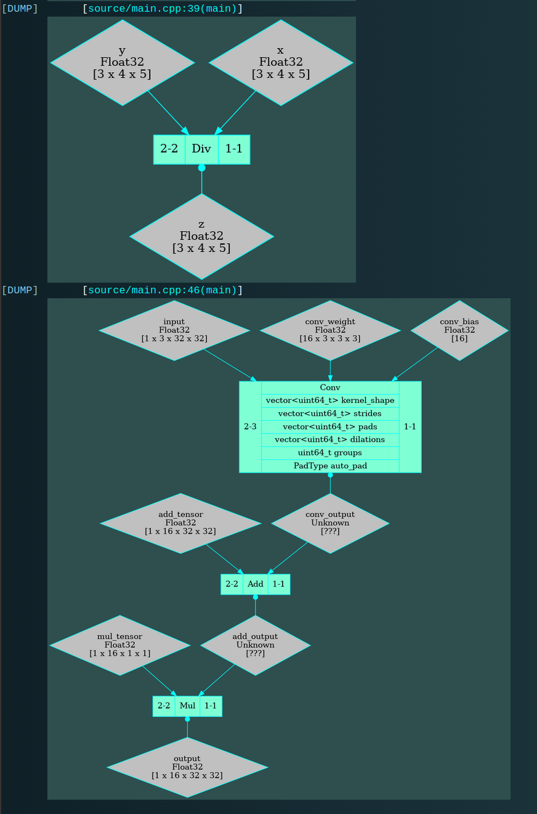

# Tenpiler - тензорный компилятор

Это учебный проект 4-го семестра по созданию собственного тензорного компилятора. Курс "Введение в тензорные компиляторы"

Авторы: 
-   Попов Владимир, Б01-411
-   Шелонин Арсений, Б01-411

## Зависимости

| Зависимость           | Минимальная версия    | Назначение                                    |
|-----------------------|-----------------------|-----------------------------------------------|
| **CMake**             | 3.26                  | Сборка проекта и зависимостей                 |
| **Protobuf**          | 3.12.4                | Десериализация ONNX-файлов                    |
| **ONNX (libonnx)**    | 1.14                  | Работа со структурой графа                    |
| **GCC / Clang**       | GCC 10 / Clang 11     | Компиляция C++20 кода                         |
| **Python3**           | 3.10                  | Кодогенерация                                 |
| **fmt**               | 8.32                  | Логгер и дамп графа                           |
| **Graphviz**          | 2.43                  | дамп графа                                    |

### Установка зависимостей (Ubuntu/Debian)

#### 1. Системные зависимости
```bash
sudo apt update
sudo apt install -y \
    build-essential \
    git \
    wget \
    libprotobuf-dev protobuf-compiler \
    snap \
    libfmt-dev \
    python3.10 python3.10-venv python3.10-dev
```

#### 2. CMake

```bash
sudo snap install cmake --classic
# Если уже есть cmake из apt, а он скорее всего слишком старый, то для использования нового из snap выполните
echo 'export PATH="/snap/bin:$PATH"' >> ~/.bashrc # или ~/.zshrc
source ~/.bashrc # или ~/.zshrc
```

#### 3. ONNX
```bash
# Клонируем репозиторий
git clone --recursive https://github.com/onnx/onnx.git ~/onnx
cd ~/onnx

# Собираем и устанавливаем
mkdir -p build && cd build
cmake .. \
  -DONNX_BUILD_TESTS=OFF \
  -DONNX_USE_PROTOBUF_SHARED_LIBS=ON \
  -DCMAKE_BUILD_TYPE=Release

make -j$(nproc)
sudo make install
sudo ldconfig # обновление кэша динамических библиотек
```

## Сборка проекта

```bash
git clone --recursive https://github.com/kzueirf12345/tenpiler
cd tenpiler

cmake -B build -DCMAKE_BUILD_TYPE=Release # -DSANITIZE=ON включение санитайзеров
cmake --build build -j$(nproc)
```

## Запуск
```bash
./build/tenpiler
```

|       OPTIONS                    |                                   |
|----------------------------------|-----------------------------------|
| `-h`, `--help`                   |   Вывести помощь                  |
| `-f`, `--input_onnx` `<FILE>`    | Задать имя входного onnx файла    |
| `-l`, `--logspace`   `<FOLDER>`  | Задать пространство для логов |


## Frontend

### Описание классов

Работа производиться с нейросетями в формате onnx. Для считывания из бинарного формата используется бибилиотека onnx-runtime, работающая с использованием Protobuf. Собственная структура ```Graph``` инкапсулирует конструирование из ```GraphProto```, поэтому не составит труда поменять формат и библиотеку для парсинга бинарного формата. 

Состовляющими графа являются тензоры (рёбра) и операции (узлы/ноды). 

### Тензоры

```cpp
// graph/Tensor.hpp

struct Tensor {
    std::string name; ///< Уникальное на весь граф имя тензора 
    std::vector<uint64_t> shape; ///< Форма. Количество данных по каждому измерению

    // Здесь перечислены все поддерживаемые на данный момент типы
    enum class Type {
        Unknown = 0,
        Float16 = 1,
        Float32 = 2,
        Float64 = 3,
        Uint8   = 4,
        Uint16  = 5,
        Uint32  = 6,
        Uint64  = 7,
        Int8    = 8,
        Int16   = 9,
        Int32   = 10,
        Int64   = 11,
        String  = 12,
        Bool    = 13,
    };

    Type type = Tensor::Type::Unknown; ///< Тип данных.
};
```

> TODO - Тензоры, форма которых должна выводиться, пока что остаются незаполненными

### Ноды

Каждая операция является наследником базового класса ```Node```, реализованного паттерном type erasure через model-concept. Это сделано, чтобы узел на брал на себя ответственность ни за что, кроме хранения данных.

#### Базовый класс

```cpp
// graph/Node/Node.hpp

// Класс, который будет содержаться в каждой операции, определяющий обязательные поля для ноды
struct NodeMeta {
    std::string op_type;              ///< Тип операции ("add", "conv", ...)
    std::vector<std::string> inputs;  ///< Список имён входных тензоров
    std::vector<std::string> outputs; ///< Список имён выходных тензоров
};

template <typename T>
concept IsTenpilerNode = requires(T node) {
    { node.meta() } noexcept -> std::convertible_to<const NodeMeta&>;
};

class Node {
    
private:

    struct Concept {
        virtual getName     ()     = 0;
        virtual getInputs   ()     = 0;
        virtual getOutputs  ()     = 0;
        virtual getAttribute(name) = 0;

        /* Другие pure virtual методы, для работы с узлами*/

        // Необходимо для корректного копировая
        virtual std::unique_ptr<Concept> clone() const = 0; 
    };

    template <typename T>
    struct Model : Concept {

        T node_instance;

        getName   () override { return node_instance.meta().op_type; }
        getInputs () override { return node_instance.meta().inputs;  }
        getOutputs() override { return node_instance.meta().outputs; }

        getAttribute(const std::string& name) override {
            // Функции, полимофорно перегруженные от типа node_instance
            return GetAttribute(node_instance, name);
        }

        /* Реализация других методов требуемых Concept */

        std::unique_ptr<Concept> clone() const override {
            return std::make_unique<Model<T>>(*this);
        }
    };

private:

    // Имеется ввиду не идиома pimpl, а что это указатель на класс, реализующий функционал
    std::unique_ptr<Concept> pImpl;

public: // BIG FIVE

    template <IsTenpilerNode T> 
    Node(T node)            : pImpl(std::make_unique<Model<T>>(std::move(node))) {}

    Node(const Node& other) : pImpl(other.pImpl->clone()) {}

    Node& operator=(const Node& other) {
        if (this != &other) {
            pImpl = other.pImpl->clone();
        }
        return *this;
    }

    Node(Node&&)            = default;
    Node& operator=(Node&&) = default;
    ~Node()                 = default;

public: // Публичные методы

    sayMyName () { return pImpl->getName   (); }
    getInputs () { return pImpl->getInputs (); }
    getOutputs() { return pImpl->getOutputs(); }

    // Упрощённо
    template <typename T>
    T getAttribute(name) { return (T)(pImpl->getAttribute(name)); }

    /* Реализация других методов через pImpl */
};
```

#### NodeFactory

Создание нод реализуется через фабрику с реестром. Для регистрации в compile-time используется библиотека ```frozen``` (лежит в libs) предоставляющая constexpr хэш-таблицу.

```cpp
class NodeFactory {

public:

    NodeFactory() = delete;

    // Реализует поиск по имени операции в registry_
    static Node Create(const onnx::NodeProto& onnx_node);

    using CreateFunc_t = std::function<Node (const onnx::NodeProto& node_onnx)>;

private:

    inline static constexpr auto registry_ = 
        frozen::make_unordered_map<frozen::string, CreateFunc_t>({

// Сгенерированный файл с перечислением всех операций и их функций создания (объявлены в приватном хедере)
#include "MAP_NodeOnnxCreator.hpp" 

    });

};
```

#### Codegen

Так как операций у нас много, методов и интерфейсов на них надо писать много, чтобы можно было в одном месте указывать всю информацию, мы написали кодогенерацию тех частей, где каждую ноду нужно обрабатывать по своему. Описание каждой операции лежит в ```graph/codegen/OpsTableGen.json```.

Шаблон описания операций

```json
{
  "namespace": "tenpiler::graph",
  "operations": [
    {
      "name": "OperationName",
      "onnx_name": "OnnxOpertaionName",
      // Минимальное и макисмальное количество входных тензоров
      "inputs": { "min": 1, "max": 100 },
      // Минимальное и макисмальное количество выходных тензоров
      "outputs": { "min": 1, "max": 100 },
      "attributes": [
        {
          "name": "Attribute1Name",
          "type": "Attribute1Type",
          "default": "Attribute1DefaultValue" // Если атрибут обязательный - null
        },
        {
          "name": "AttributeEnumName",
          "type": "enum",
          "enum_name": "AttributeEnum_EnumName",
          "enum_values": ["Value1", "Value2" /*...*/],
          // Считается что у enum-аттрибутов обязательно должно быть дефолтное значение
          "default": "NOTSET"
        },
        // Другие аттрибуты...
      ],
      "constraints": [ 
        // Здесь указываются инварианты, которые должны соблюдаться и иные более специфичные правила, не описанные раннее.
        {
          "type": "check",
          "condition": "SomeAttribute.empty()",
          "description": "SomeAttribute must not be empty"
          /*!SECTION
          if (condition) {
            throw std::runtime_error(description);
          }
          */
        },
        {
          "type": "set_default",
          "condition": "SomeAttribute.empty()",
          "attr_name": "SomeAttribute",
          "value": "std::vector<uint64_t>(OtherAttribute.size(), 1)"
          /*!SECTION
          if (condition) {
            attr_name = value;
          }
          */
        },
        // Другие инварианты...
      ]
    },
    // Описание других операций...
  ]
}
```

### Граф

```cpp
class Graph {

public:

    void LoadFromOnnx(std::istream& input_onnx);

    // Геттеры на поля...

private:

    std::unordered_map<std::string, Tensor> tensors_; ///< Список всех тензоров по именам
    
    std::vector<Node> nodes_; //< Список узло
    
    std::vector<std::string> input_; ///< Список имён входных тензоров
    std::vector<std::string> output_; ///< Список имён выходных тензоров
    
};
```

#### Дамп

Дамп графа реализован через универсальный логгер, который подключён как сабмодуль (lib/RLogSU). Функция дампа реализована в graph/src/Dumber.cpp, а описание каждой ноды в формате dot кодгенится в graph/src/Node/OpsDumb.cpp. Вот пример.




